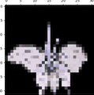
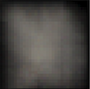
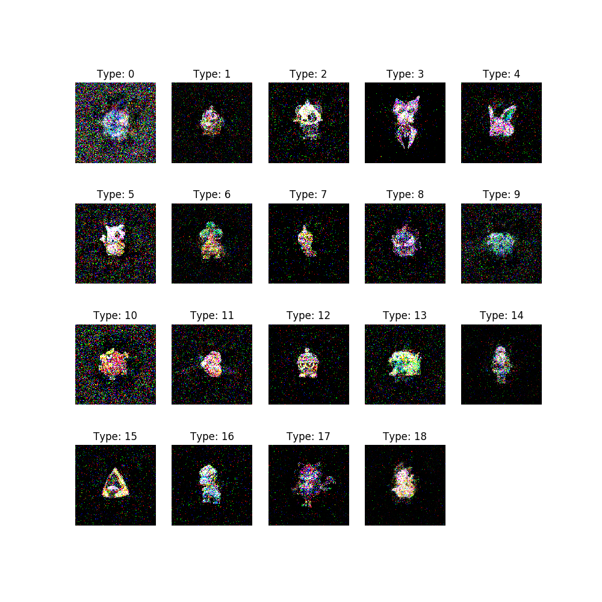
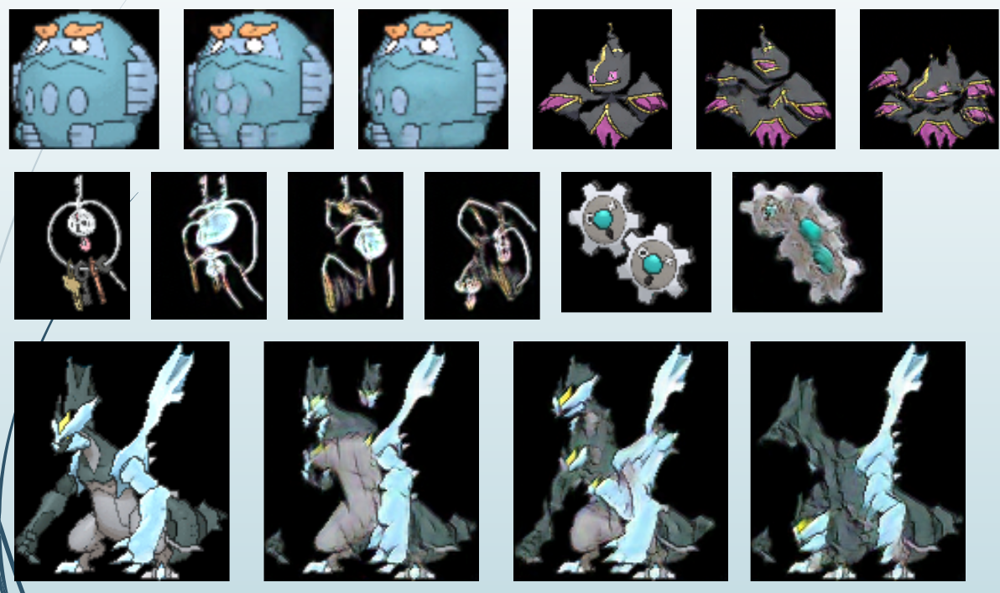
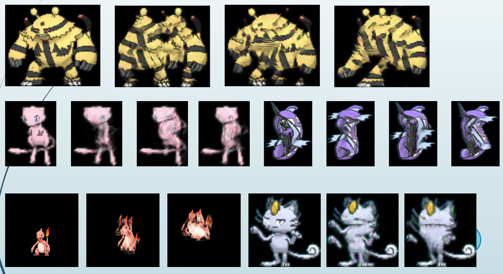

# Pokemon-gan
Generate Pokemon using some GANs.

# Result
## DCGAN


## AE
Try VAE, but failure not only VAE but also AE.
### Input


### Output


## CGAN


## Sin GAN
### Random Sampling



# Usage
1. `cd Pokemon-gan`
1. Collect 64x64x3 Pokemon image into `poke64` directory.

## DCGAN
1. `pipenv run python3 ./dcgan.py`

## VAE
1. `pipenv run python3 ./vae/vae.py`

## CGAN
1. `cd cgan/`
1. Create `./cgan/info.pickle`. This file has image path and Pokemon's types as `pd.DataFrame`.
1. `pipenv run python3 cgan.py`

## Sin GAN
1. Using [Google Colab](https://colab.research.google.com/). Create account.
1. Clone [repository](https://github.com/tamarott/SinGAN) and configure.
```py
from google.colab import drive
drive.mount('/content/drive')
!git clone https://github.com/tamarott/SinGAN.git "/content/drive/My Drive/SinGAN"

import os
os.chdir('/content/drive/My Drive/SinGAN/')

import torch
torch.cuda.is_available()
```
1. Upload into `/SinGAN/Input/Images/`.
1. Execution.
```py
!python main_train.py --input_name "filename"
```
