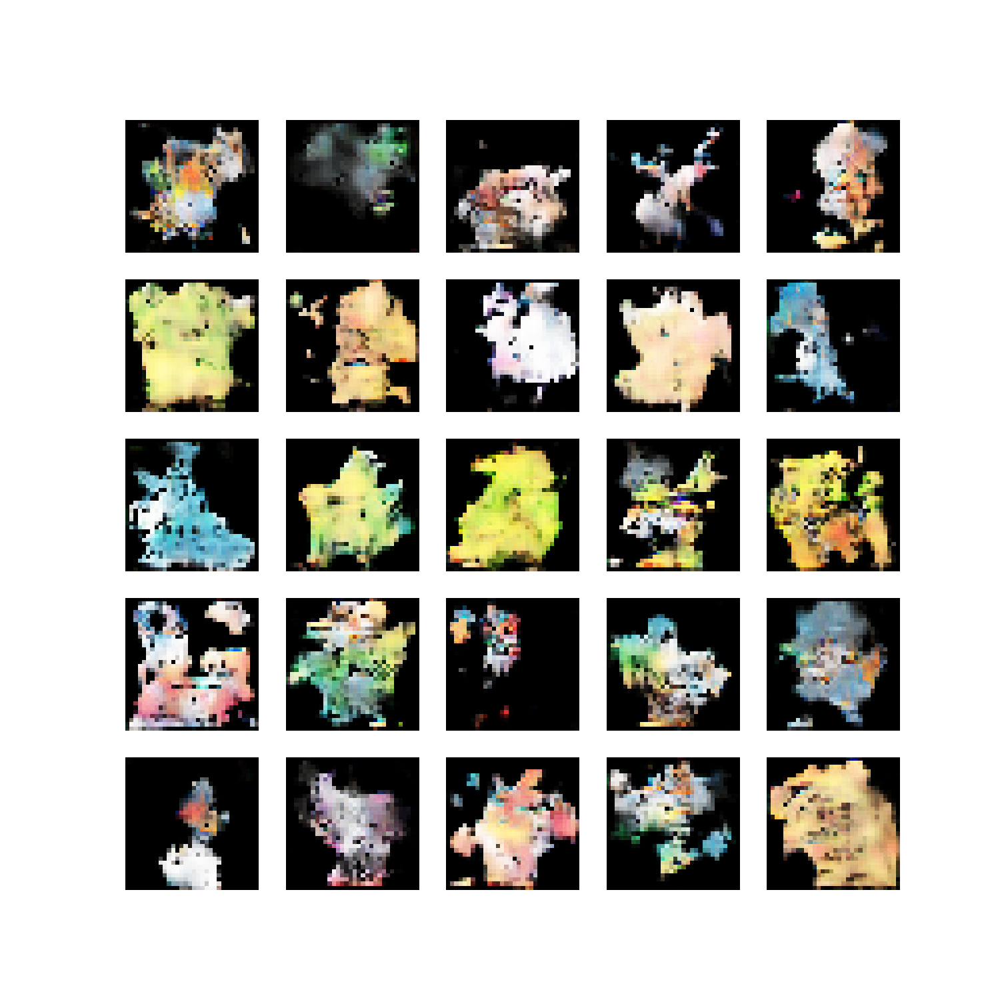
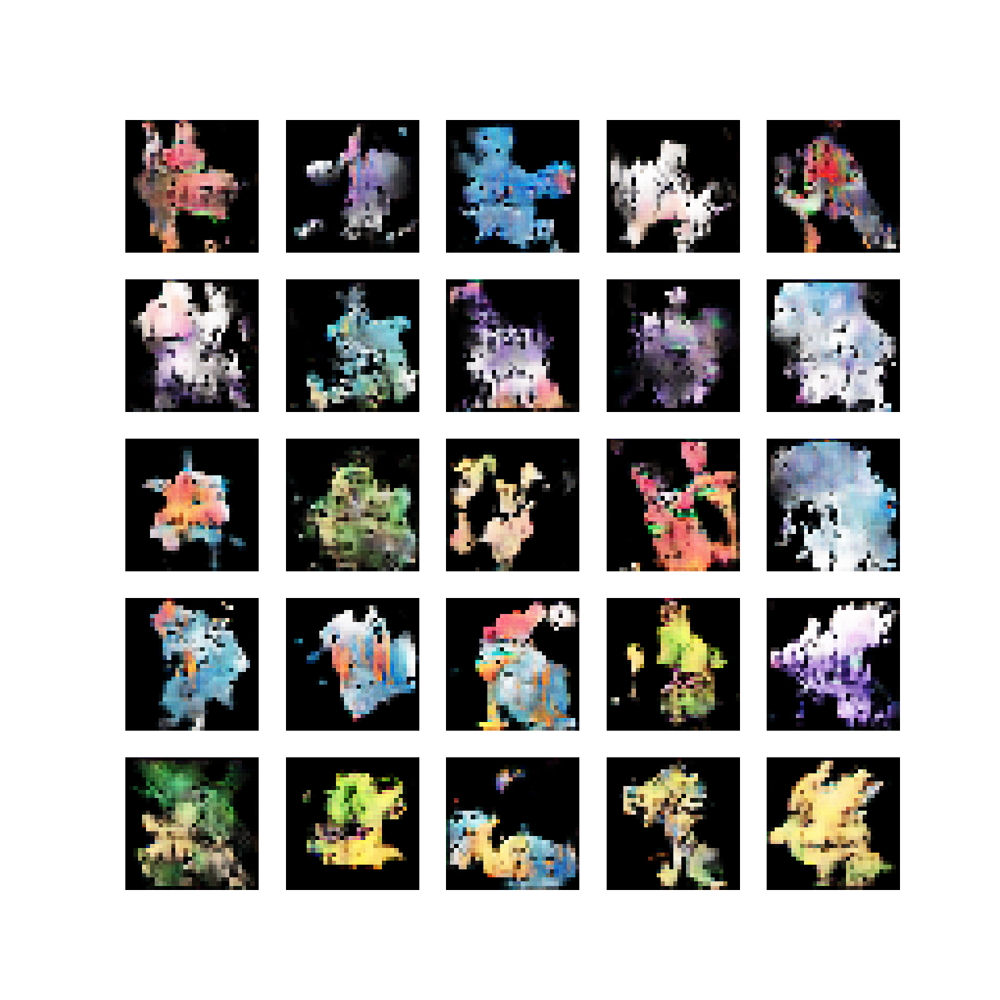
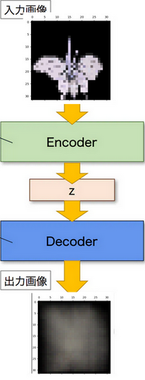

# Pokemon-gan
Generate Pokemon using some GANs.

# Result
## DCGAN

## VAE

## CGAN

# Usage
1. `cd Pokemon-gan`
1. Collect 64x64x3 Pokemon image into `poke64` directory.

## DCGAN
1. `pipenv run python3 ./dcgan.py`

## VAE
1. `pipenv run python3 ./vae/vae.py`

## CGAN
1. `cd cgan/`
1. Create `./cgan/info.pickle`. This file has image path and Pokemon's types as `pd.DataFrame`.
1. `pipenv run python3 cgan.py`
